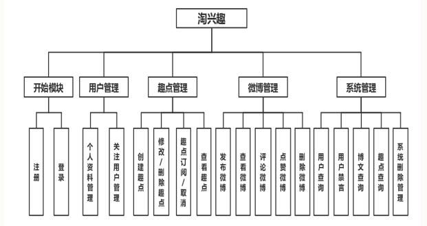

## 淘兴趣在线分享网站

- [项目介绍PPT](13组项目展示.pptx)
- [项目接口设计概览](接口设计.md) 

**项目结构**： 

- 使用三层结构和MVC模型设计程序结构
- 使用SSM(spring + springMVC + MyBatis)作后端开发
- 使用Vue.js和element 桌面端组件库配合完成前端页面及设计
- 创建一个用户可以互相分享生活中各种趣事的交流平台

**项目功能概览**： 

